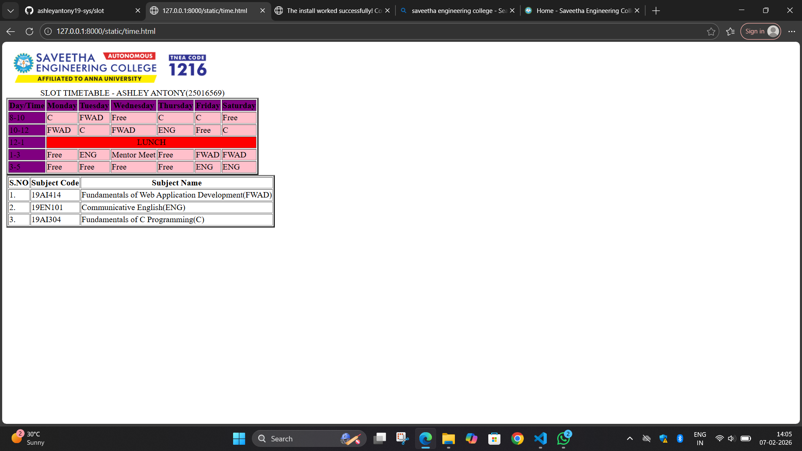

# Ex03 Time Table
## Date:07.02.2026
## Reference number:25016569
## AIM
To write a html webpage page to display your slot timetable.

## ALGORITHM
### STEP 1
Create a Django-admin Interface.

### STEP 2
Create a static folder and inert HTML code.

### STEP 3
Create a simple table using ```<table>``` tag in html.

### STEP 4
Add header row using ```<th>``` tag.

### STEP 5
Add your timetable using ```<td>``` tag.

### STEP 6
Execute the program using runserver command.

## PROGRAM
```
<html>
    <head>
        <title></title>
    </head>
    <body>
        
        <table border="3">
            <caption>SLOT TIMETABLE - ASHLEY ANTONY(25016569)</caption>
            <tr bgcolor="purple">
                <th>Day/Time</th>
                <th>Monday</th>
                <th>Tuesday</th>
                <th>Wednesday</th>
                <th>Thursday</th>
                <th>Friday</th>
                <th>Saturday</th>
            </tr>
            <tr bgcolor="pink">
                <td bgcolor="purple">8-10</td>
                <td>C</td>
                <td>FWAD</td>
                <td>Free</td>
                <td>C</td>
                <td>C</td>
                <td>Free</td>
            </tr>
            <tr bgcolor="pink">
                <td bgcolor="purple">10-12</td>
                <td>FWAD</td>
                <td>C</td>
                <td>FWAD</td>
                <td>ENG</td>
                <td>Free</td>
                <td>C</td>
            </tr>
            <tr bgcolor="red">
                <td bgcolor="purple">12-1</td>
                <td colspan="6" align="center"> LUNCH</td>
            </tr>
            <tr bgcolor="pink">
                <td bgcolor="purple">1-3</td>
                <td>Free</td>
                <td>ENG</td>
                <td>Mentor Meet</td>
                <td>Free</td>
                <td>FWAD</td>
                <td>FWAD</td>
            </tr>
            <tr bgcolor="pink">
                <td bgcolor="purple">3-5</td>
                <td>Free</td>
                <td>Free</td>
                <td>Free</td>
                <td>Free</td>
                <td>ENG</td>
                <td>ENG</td>
            </tr>
        </table>
        <table border="3">
            <tr>
                <th>S.NO</th>
                <th>Subject Code</th>
                <th>Subject Name</th>
            </tr>
            <tr>
                <td>1.</td>
                <td>19AI414</td>
                <td>Fundamentals of Web Application Development(FWAD)</td>
            </tr>
            <tr>
                <td>2.</td>
                <td>19EN101</td>
                <td>Communicative English(ENG)</td>
            </tr>
            <tr>
                <td>3.</td>
                <td>19AI304</td>
                <td>Fundamentals of C Programming(C)</td>
            </tr>
        </table>
    </body>
</html>
```

## OUTPUT


## RESULT
The program for creating slot timetable using basic HTML tags is executed successfully.
